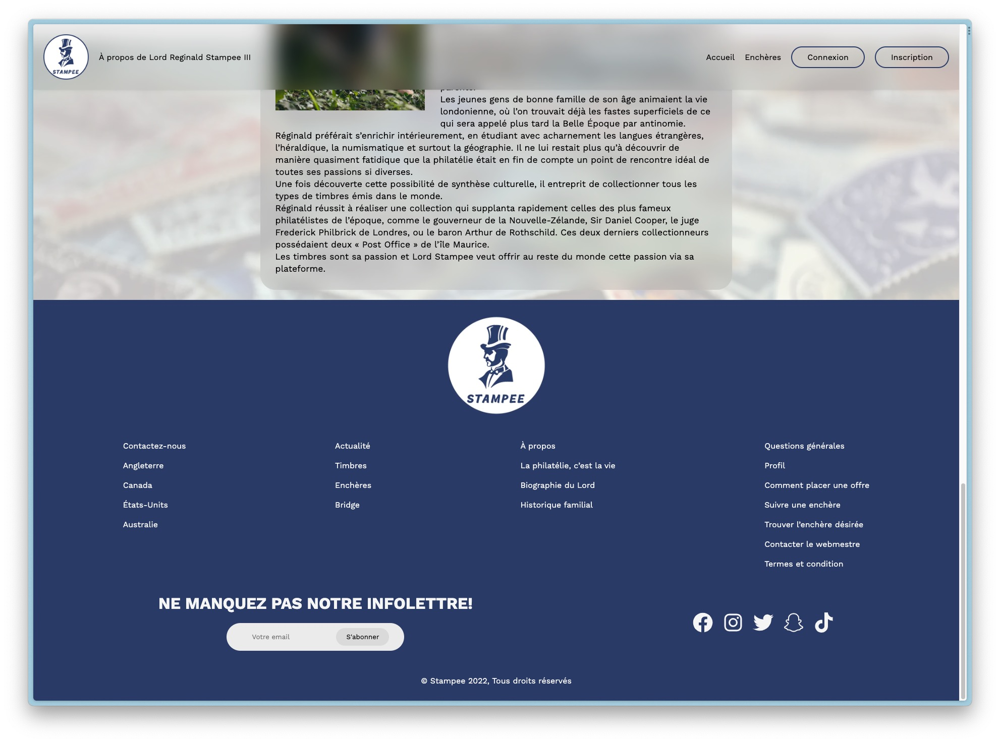

# Stampee

Projet d'école pour finir la troisième session de ma formation.  
Ce projet consiste à créer un site web avec les technologies (HTML, CSS, JavaScript, PHP MVC).  
Le projet est structuré avec la méthodologie agile (SCRUM).

## Mise en contexte

Lord Reginald Stampee nous a choisis pour le développement d'une plateforme d'enchères de timbres.

## Objectifs de la plateforme d’enchères « Stampee »

Back-end

1. Pouvoir créer une enchère de timbre en tant que membre
2. Pouvoir enchérir sur une enchère en tant que membre
3. Trouver rapidement des enchères précises (filtres de recherche et barre de recherche)
4. Création d'une base de données mySql

Front-end

1. Possibilité de voir les timbres de proche ( réaliser en JS )
2. Site adapté pour les tablettes et mobile
3. Une espace membre et une espace administrateur

## La réalisation

Pour ce projet, je suis parti de 0, j'ai fait des recherches pour créer une identité visuelle, à savoir le logo, la typographie, les couleurs, les pictogrammes et les icônes.  
J'ai aussi créé des esquisses du site web en wireframes puis j'ai fait la création de la maquette du projet sur Figma.  
Une fois le design et l'identité visuelle, j'ai procédé à la création des pages web en HTML-CSS (l'utilisation de framework n'était pas permise).  
Une fois la réalisation front-end réaliser, je suis passer au back-end, j'ai donc créer le schéma de la base de donnée avec les différents entités et relations, puis j'ai créer celle-ci.  
Par la suite j'ai adapté le projet en MVC.

Il nous a été demandé de travailler avec la méthode de gestion de projet AGILE et le framework SCRUM.

#Stampee

School project to finish the third session of my training.
This project consists in creating a website with technologies (HTML, CSS, JavaScript, PHP MVC).
The project is structured with the agile methodology (SCRUM).

## In context

Lord Reginald Stampee chose us for the development of a stamp auction platform.

## Objectives of the "Stampee" auction platform

Back end

1. Be able to create a stamp auction as a member
2. Being able to bid on an auction as a member
3. Quickly find specific auctions (search filters and search bar)
4. Creating a mySql database

Front end

1. Possibility to see the stamps up close (made in JS)
2. Site adapted for tablets and mobiles
3. A member area and an administrator area

## The realization

For this project, I started from 0, I did research to create a visual identity, namely the logo, typography, colors, pictograms and icons.
I also created sketches of the website in wireframes then I created the model of the project on Figma.
Once the design and the visual identity, I proceeded to the creation of web pages in HTML-CSS (the use of framework was not allowed).
Once the front-end was done, I moved on to the back-end, so I created the database schema with the different entities and relationships, then I created this one.
Then I adapted the project in MVC.

We were asked to work with the AGILE project management method and the SCRUM framework.

